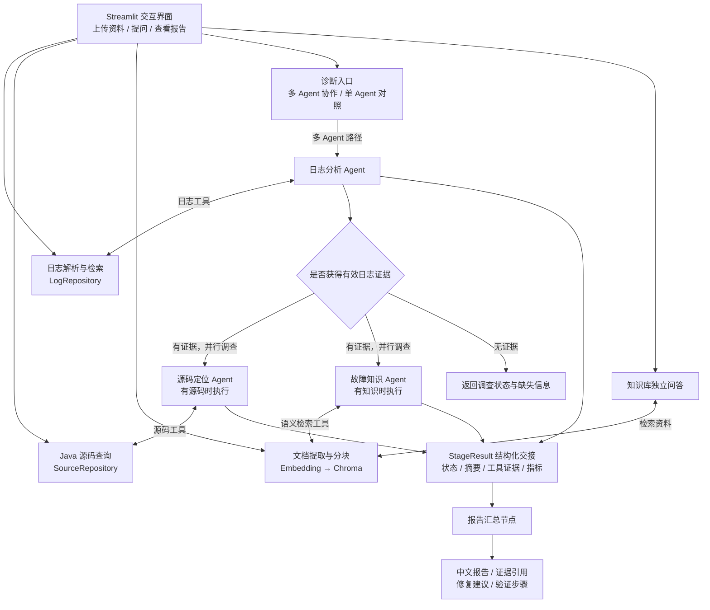

# Spring Boot 日志诊断 Agent

**面向 Java / Spring Boot 应用的多 Agent 故障调查助手，将日志、源码与历史排障知识连接起来，生成可追溯的诊断报告。**

上传日志及相关 Java 源码，用自然语言提出问题。系统通过工具检索异常、关联请求上下文、读取源码位置，并参考知识库中的排障经验，给出故障原因分析、修复建议和验证步骤。

适用于本地故障复现、异常堆栈调查、历史故障知识沉淀，以及 Agent 工程实践。

## 项目亮点

### 1. 日志优先的多 Agent 协作

将调查拆分为日志分析、源码定位和故障知识三个专业角色，各角色使用独立的模型实例、工具集合与调用回调：

- **日志分析 Agent**：先定位异常和请求上下文，为后续调查提供共同线索。
- **源码定位 Agent**：依据日志中的文件名、行号和异常位置，检查上传的 Java 实现。
- **故障知识 Agent**：检索历史故障、运维手册与解决方案，提供参考经验。
- **报告汇总节点**：整合各阶段证据与状态，生成中文诊断报告，不再调用工具。

源码调查与知识检索在具备对应资料时并行执行。流程由 Python 显式编排，角色内部使用 LangChain 工具调用 Agent，既保留自主调查能力，也明确执行顺序和职责边界。

### 2. 关联日志、请求链路和源码位置

针对 Spring Boot 排障场景处理日志，而非仅将整份文件交给模型：

- 合并 Java 多行异常堆栈，保留原始起止行号。
- 提取时间、级别、服务、traceId、线程、logger 和异常类型。
- 根据异常链提取底层异常线索，支持 Spring Boot 文本日志和逐行 JSON 日志。
- 优先按 traceId 补查上下文，缺少 traceId 时查看相邻日志。
- 根据堆栈中的文件名与行号读取源码片段，也支持关键词搜索。
- 长请求上下文围绕目标日志保留有限记录，减少无关内容进入模型。

报告可以同时引用日志 ID、原始行号和源码位置，便于回到输入资料核查结论。

### 3. 用结构化证据交接约束协作

角色之间通过 `StageResult` 传递状态、调查摘要、工具证据、失败原因和调用指标。

证据由程序从工具响应中提取；错误响应、空检索结果和单纯的文件列表不作为有效诊断证据。交接控制字符预算，尽量保留完整记录，并在省略内容时标记截断。

提示词要求区分**已确认事实、合理推测和待验证事项**，并核对日志与源码是否支持结论。完整工具调用过程可在页面中展开查看；这些约束用于提高可核查性，不代表自动保证结论正确。

### 4. RAG 知识库同时服务诊断与问答

支持导入 TXT、Markdown 和文本型 PDF，经过文本提取、分块、Embedding 后持久化到 Chroma。

知识库有两条使用路径：

- **辅助诊断**：故障知识 Agent 根据本次异常检索相关排障经验。
- **独立问答**：用户直接询问运维知识，由检索结果支撑回答并标注资料来源。

历史经验作为参考，当前故障的判断仍需结合当前日志和源码证据。

### 5. 将失败处理和可观测性纳入工作流

- 无有效日志证据时停止后续调查，避免继续生成无依据的诊断。
- 未上传源码或知识库为空时，跳过相应分支。
- 可选分支失败时，尝试基于已有证据生成报告，并标记未完整完成。
- 汇总失败时保留阶段状态与调查过程，返回可检查的信息。
- 展示阶段耗时、模型调用次数、工具调用记录及接口返回的 Token 用量。
- 保留单 Agent 模式，支持对相同输入进行单 / 多 Agent 对照。

## 系统架构



编排使用 `ThreadPoolExecutor` 执行两个独立调查分支。工作线程不操作 Streamlit 会话；汇总结果返回主流程后统一展示。详细执行规则见 [多 Agent 诊断说明](MULTI_AGENT.md)。

### 角色与工具权限

| 角色 | 可用工具 | 主要产出 |
| --- | --- | --- |
| 日志分析 Agent | `search_logs`、`get_log_context`、`count_errors` | 异常线索、关联请求、日志证据 |
| 源码定位 Agent | `list_source_files`、`get_source_context`、`search_source_code` | 对应实现、可疑代码位置、源码证据 |
| 故障知识 Agent | `search_knowledge_base` | 相关排障资料与来源 |
| 报告汇总节点 | 不使用工具 | 综合结论、修复建议、验证步骤 |

专业 Agent 最多执行 5 次迭代，执行器时间预算为 120 秒；单次模型请求超时为 60 秒，最多重试一次。执行器在迭代间检查预算，这些配置不是整个诊断请求的硬超时。

### 数据与模型调用边界

日志解析、日志筛选、源码读取和统计在本地完成；诊断时，相关问题、历史上下文和工具返回的证据会发送到配置的模型接口。知识库写入及语义检索需要调用 Embedding 接口。

日志和上传的 Java 源码由当前应用会话使用，知识向量持久化在本地 `chroma_db/`。页面浏览及本地日志检索不需要调用大模型。

## 功能入口

| 页面 | 用途 |
| --- | --- |
| 仪表盘 | 查看当前数据概况，作为默认首页 |
| 智能诊断 | 切换单 / 多 Agent 模式、自然语言提问、继续追问、查看过程与下载报告 |
| 日志中心 | 按关键词、级别、traceId 筛选日志，检查原始行号与请求上下文 |
| 故障知识库 | 导入排障资料、查看已入库来源、进行知识问答 |
| 项目评估 | 运行内置故障案例，检查本地解析、检索与上下文关联能力 |

## 技术栈

| 技术 | 项目中的职责 |
| --- | --- |
| Python | 日志处理、数据访问、工作流与后端逻辑 |
| Streamlit | 中文界面、文件上传、会话交互、报告展示 |
| LangChain | 专业 Agent、工具调用循环与回调机制 |
| 通义千问 / OpenAI 兼容接口 | 日志调查、源码分析、报告生成与知识问答 |
| ChromaDB | 本地知识向量持久化和相似度检索 |
| Embedding 模型 | 将文档片段与查询转换为向量 |
| Pandas | 日志与评估数据表展示 |
| PyPDF | 提取 PDF 文本 |
| unittest | 解析、工具、协作流程与失败分支测试 |

当前工作流使用 Python 显式编排，未引入 LangGraph。Java / Spring Boot 是被分析的应用技术栈，运行本项目无需启动 Java 应用或 Redis 服务。依赖版本见 [requirements.txt](requirements.txt)。

## 快速开始

### 1. 安装并启动

在包含 `app.py` 的项目根目录执行。当前验证环境为 **Windows / Python 3.13.5**。

```powershell
python -m venv .venv
.\.venv\Scripts\python.exe -m pip install -r requirements.txt
.\.venv\Scripts\python.exe launch.py
```

### 2. 配置模型

复制配置模板：

```powershell
Copy-Item .env.example .env
```

### 3. 体验一次完整诊断

1. 使用内置演示数据，或上传 [演示日志](samples/spring_boot_demo.log) 与 [配套 Java 源码](samples/java)。
2. 进入“故障知识库”，点击“导入演示手册”；该步骤需要可用的 Embedding 接口，也可先跳过。
3. 进入“智能诊断”，选择“多 Agent 协同诊断”，输入：

   > 请分析 trace-redis-002 的订单失败原因，结合日志和 Java 源码给出证据、修复建议与验证步骤。

4. 查看日志、源码、知识三个调查阶段及汇总结果，展开工具调用核对原始证据。
5. 继续追问“哪些结论已经确认，哪些还需要补充验证？”，或下载 Markdown 报告。

演示日志还包含数据库连接池超时和 MQ 消费下游超时场景，可替换问题继续调查。

### 上传格式与限制

| 资料 | 格式 | 应用限制 |
| --- | --- | --- |
| 日志 | LOG、TXT、JSON（逐行 JSON 对象） | 单文件不超过 10 MB |
| 源码 | JAVA | 最多 30 个文件，总大小不超过 5 MB |
| 知识文档 | TXT、Markdown、PDF | 单次选择的文件总大小不超过 20 MB |

PDF 当前通过文本提取读取，不支持扫描件 OCR。

## 代码目录

```text
.
├── app.py                         # Streamlit 页面与会话交互
├── launch.py                      # 端口选择、服务启动与浏览器打开
├── start.cmd                      # Windows 启动入口
├── agent/
│   ├── diagnosis_agent.py         # 模式分发与单 Agent 基线
│   ├── workflow.py                # 多 Agent 编排、并行调查与汇总
│   ├── specialists.py             # 专业 Agent 执行与证据提取
│   ├── state.py                   # StageResult 与交接预算
│   ├── tools/
│   │   ├── log_tools.py           # 日志搜索、上下文与统计
│   │   ├── source_tools.py        # Java 文件、行号与关键词查询
│   │   └── knowledge_tools.py     # 知识库语义检索
│   └── middleware/
│       └── observability.py       # 工具事件、模型调用与 Token 统计
├── core/
│   ├── models.py                  # 结构化日志模型
│   └── parser.py                  # 文本 / JSON 解析与堆栈合并
├── repositories/
│   ├── log_repository.py          # 日志查询与 traceId 上下文
│   └── source_repository.py       # 堆栈位置匹配与源码读取
├── rag/
│   └── knowledge_base.py          # 分块、向量入库、检索与知识问答
├── model/
│   └── factory.py                 # 聊天模型与 API 客户端创建
├── config/
│   └── settings.py                # 默认配置与文件限制
├── prompts/                       # 角色、汇总及知识问答提示词
├── utils/
│   ├── document_loader.py         # TXT / Markdown / PDF 读取
│   └── prompt_loader.py           # 提示词文件加载
├── evaluation/
│   ├── evaluator.py               # 本地固定案例评估
│   └── compare_agents.py          # 单 / 多 Agent 真实接口对照
├── evals/
│   └── cases.json                 # 三类故障的预期结果
├── samples/
│   ├── spring_boot_demo.log       # Spring Boot 故障演示日志
│   ├── java/                      # 配套源码
│   └── knowledge/                 # 演示排障手册
├── tests/
│   ├── test_log_diagnosis_agent.py # 解析、仓储、工具与分块测试
│   └── test_multi_agent.py         # 协作、隔离、降级与用量测试
├── .env.example                   # 不含密钥的配置模板
├── requirements.txt               # Python 依赖
└── MULTI_AGENT.md                  # 多 Agent 执行细节与对照方法
```

模块按职责划分：界面负责交互，Agent 层负责调查与编排，工具层暴露可调用能力，仓储层处理日志和源码查询，RAG 层管理知识检索，模型工厂统一创建客户端。提示词独立存放，便于调整角色规则与报告要求。

## 测试与评估

### 自动化测试

当前测试集包含 **24 项测试**，默认不请求外部模型。覆盖范围包括：

- 多行堆栈、底层异常提取、原始行号、混合格式日志 ID。
- 关键词查询、长 traceId 上下文、Java 源码匹配。
- 文档分块与知识库工具注册。
- 多 Agent 调用流程、工具权限隔离和分支并行。
- 缺少资料、日志无证据、分支失败、汇总失败等路径。
- 证据交接预算与 Token 用量统计。

“项目评估”使用 Redis 连接失败、数据库连接池超时、MQ 下游超时三个固定案例检查解析与检索结果，**不等同于大模型诊断准确率评测**。

### 单 / 多 Agent 对照

配置可用的 API Key 后执行：

两种模式使用相同问题、日志和源码，分别从空历史开始。命令会调用真实模型并消耗额度，输出报告与耗时、模型调用、工具调用、Token 指标到 `evaluation/results/`；该目录默认不纳入 Git。

支持通过 `--log`、`--sources`、`--question` 指定输入，通过 `--knowledge` 启用已有知识库。对照时应同时核查证据引用、根因判断、修复建议、耗时与调用成本，而不能仅以 Agent 数量判断效果。

Token 统计来自模型接口返回，不包含 Embedding 用量；接口未返回用量时记录为 0。

## 当前能力边界

- 面向上传文件与演示数据，尚未接入 Loki、Prometheus 或实时告警链路。
- 源码分析基于上传文件的文本检索与行号定位，不执行 Java 编译或静态语义分析。
- 支持生成修复代码片段与修改建议，不自动修改源码或执行生产操作。
- 缺少部署、指标或外部系统证据时，相关根因仍需补充验证。
- 多 Agent 侧重调查分工与过程可追溯性，不保证比单 Agent 更快、更省 Token 或始终更准确。