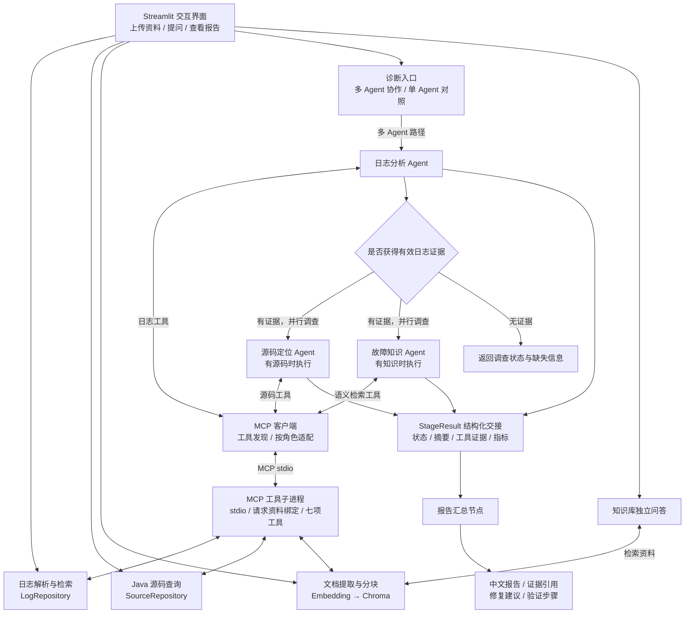

# LogPilot · 多 Agent 智能日志诊断系统

**日志调查 · 源码定位 · RAG 故障知识库 · MCP 工具服务 · 可追溯诊断报告**

**面向 Java / Spring Boot 应用的多 Agent 故障调查助手，将日志、源码与历史排障知识连接起来，生成可追溯的诊断报告。**

上传日志及相关 Java 源码，用自然语言提出问题。系统通过工具检索异常、关联请求上下文、读取源码位置，并参考知识库中的排障经验，给出故障原因分析、修复建议和验证步骤。

适用于本地故障复现、异常堆栈调查、历史故障知识沉淀，以及 Agent 工程实践。

[项目亮点](#项目亮点) · [系统架构](#系统架构) · [快速开始](#快速开始) · [代码目录](#代码目录) · [测试与评估](#测试与评估) · [常见问题](#常见问题)

## 项目解决什么问题

一次故障排查通常需要在异常堆栈、请求前后日志、Java 源码和历史排障文档之间反复切换。LogPilot 将这些调查动作封装为可调用工具，由不同职责的 Agent 收集证据，再统一生成报告。用户既能看到结论，也能展开调查过程，核查结论来自哪条日志、哪个源码位置或哪份知识文档。

| 排障中的问题 | LogPilot 的处理方式 | 可核查的结果 |
| --- | --- | --- |
| 堆栈跨多行，难以看清异常链 | 聚合堆栈，提取异常类型，保留原始行号 | 日志 ID、异常链和原始行范围 |
| 单条报错缺少业务上下文 | 按 traceId 关联同一请求，无 traceId 时查邻近记录 | 失败前后的关联日志 |
| 日志指向源码，但缺少实现细节 | 读取上传的 Java 文件，按文件名、行号和关键词查询 | 带行号的代码片段与修改建议 |
| 历史排障经验散落在文档中 | 文档分块与向量入库，按当前问题语义检索 | 相关资料片段及来源 |
| 模型给出结论却难以复查 | 结构化证据交接，记录阶段状态与工具调用 | 证据、推测、缺失信息和验证步骤 |

项目包含 **3 个专业 Agent、1 个报告汇总节点、7 项 MCP 工具、3 组内置故障案例和 39 项自动化测试**。其中测试数量反映工程验证覆盖，不代表真实故障诊断准确率。

## 项目亮点

### 1. 日志优先的多 Agent 协作

将调查拆分为日志分析、源码定位和故障知识三个专业角色，各角色使用独立的模型实例、工具集合与调用回调：

- **日志分析 Agent**：先定位异常和请求上下文，为后续调查提供共同线索。
- **源码定位 Agent**：依据日志中的文件名、行号和异常位置，检查上传的 Java 实现。
- **故障知识 Agent**：检索历史故障、运维手册与解决方案，提供参考经验。
- **报告汇总节点**：整合各阶段证据与状态，生成中文诊断报告，不再调用工具。

源码调查与知识检索在具备对应资料时并行执行。流程由 Python 显式编排，角色内部使用 LangChain 工具调用 Agent，既保留自主调查能力，也明确执行顺序和职责边界。

### 2. 关联日志、请求链路和源码位置

针对 Spring Boot 排障场景处理日志，而非仅将整份文件交给模型：

- 合并 Java 多行异常堆栈，保留原始起止行号。
- 提取时间、级别、服务、traceId、线程、logger 和异常类型。
- 根据异常链提取底层异常线索，支持 Spring Boot 文本日志和逐行 JSON 日志。
- 优先按 traceId 补查上下文，缺少 traceId 时查看相邻日志。
- 根据堆栈中的文件名与行号读取源码片段，也支持关键词搜索。
- 长请求上下文围绕目标日志保留有限记录，减少无关内容进入模型。

报告可以同时引用日志 ID、原始行号和源码位置，便于回到输入资料核查结论。

### 3. 用结构化证据交接约束协作

角色之间通过 `StageResult` 传递状态、调查摘要、工具证据、失败原因和调用指标。

证据由程序从工具响应中提取；错误响应、空检索结果和单纯的文件列表不作为有效诊断证据。交接控制字符预算，尽量保留完整记录，并在省略内容时标记截断。

提示词要求区分**已确认事实、合理推测和待验证事项**，并核对日志与源码是否支持结论。完整工具调用过程可在页面中展开查看；这些约束用于提高可核查性，不代表自动保证结论正确。

### 4. RAG 知识库同时服务诊断与问答

支持导入 TXT、Markdown 和文本型 PDF，经过文本提取、分块、Embedding 后持久化到 Chroma。

知识库有两条使用路径：

- **辅助诊断**：故障知识 Agent 根据本次异常检索相关排障经验。
- **独立问答**：用户直接询问运维知识，由检索结果支撑回答并标注资料来源。

历史经验作为参考，当前故障的判断仍需结合当前日志和源码证据。

### 5. 将失败处理和可观测性纳入工作流

- 无有效日志证据时停止后续调查，避免继续生成无依据的诊断。
- 未上传源码或知识库为空时，跳过相应分支。
- 可选分支失败时，尝试基于已有证据生成报告，并标记未完整完成。
- 汇总失败时保留阶段状态与调查过程，返回可检查的信息。
- 展示阶段耗时、模型调用次数、工具调用记录及接口返回的 Token 用量。
- 保留单 Agent 模式，支持对相同输入进行单 / 多 Agent 对照。

### 6. 七项工具通过 MCP 独立提供

日志搜索、上下文查询、统计、源码列表、源码上下文、源码搜索和知识检索统一由 MCP 服务提供。客户端通过 `tools/list` 获取工具描述与参数结构，再适配为 LangChain 工具，按角色分配给三个专业 Agent。

- 使用官方 MCP Python SDK 2.2.0，采用本地 stdio 通信，不占用网络端口。
- 每次诊断创建独立子进程和资料快照，以请求 ID 绑定当次日志、源码；加载后删除快照，正常退出时清理临时目录和进程。
- API Key 通过子进程环境传入，不作为工具参数、工具描述或配置字段写入资料快照。
- 同一诊断中的并行 Agent 复用 MCP 会话，保留工具参数校验、调用超时及结构化错误处理。
- 默认诊断走 MCP；`local` 模式用于显式对照，不会在连接失败时静默切回直接调用。

此处隔离的是每次请求的日志与源码。Chroma 仍是当前本地应用共享的知识库，尚未实现多用户鉴权或租户隔离。

## 系统架构



编排使用 `ThreadPoolExecutor` 执行两个独立调查分支。工作线程不操作 Streamlit 会话；汇总结果返回主流程后统一展示。详细执行规则见 [多 Agent 诊断说明](docs/MULTI_AGENT.md)。

### 角色与工具权限

| 角色 | 可用工具 | 主要产出 |
| --- | --- | --- |
| 日志分析 Agent | `search_logs`、`get_log_context`、`count_errors` | 异常线索、关联请求、日志证据 |
| 源码定位 Agent | `list_source_files`、`get_source_context`、`search_source_code` | 对应实现、可疑代码位置、源码证据 |
| 故障知识 Agent | `search_knowledge_base` | 相关排障资料与来源 |
| 报告汇总节点 | 不使用工具 | 综合结论、修复建议、验证步骤 |

专业 Agent 最多执行 5 次迭代，执行器时间预算为 120 秒；单次模型请求超时为 60 秒，最多重试一次。执行器在迭代间检查预算，这些配置不是整个诊断请求的硬超时。

### MCP 工具目录

| 工具 | 关键输入 | 返回内容 |
| --- | --- | --- |
| `search_logs` | `keyword`、`level`、`trace_id`、`limit` | 匹配数量、日志记录、截断标记 |
| `get_log_context` | `record_id`、`window` | 同 traceId 或相邻日志、查询模式、锚点 ID |
| `count_errors` | `group_by` | 按异常类型、日志级别或服务分组的计数 |
| `list_source_files` | `query` | 已上传源码文件列表 |
| `get_source_context` | `file_name`、`line_number`、`window` | 文件中指定位置附近的源码 |
| `search_source_code` | `keyword`、`limit` | 源码关键词匹配位置 |
| `search_knowledge_base` | `query`、`limit` | 文档来源、文本块、距离与内容 |

MCP 负责标准化工具发现与调用；模型负责根据问题选择工具；仓储和 RAG 层负责执行具体查询。服务端复用现有查询逻辑，避免在协议层重复实现日志解析和源码检索。源码相关工具只读，修复代码由报告生成环节提出。

### 数据与模型调用边界

日志解析、日志筛选、源码读取和统计在本地完成；诊断时，相关问题、历史上下文和工具返回的证据会发送到配置的模型接口。知识库写入及语义检索需要调用 Embedding 接口。

日志和上传的 Java 源码由当前应用会话使用，知识向量持久化在本地 `data/chroma_db/`。页面浏览及本地日志检索不需要调用大模型。

MCP 启动握手预算为 30 秒，单次工具调用预算为 150 秒，进程清理可能带来少量额外等待。工具错误会进入阶段状态；已获取部分证据后发生工具错误的阶段标记为 `partial`。这些超时不等于整个诊断请求的硬超时。

## 功能入口

| 页面 | 用途 |
| --- | --- |
| 仪表盘 | 查看当前数据概况，作为默认首页 |
| 智能诊断 | 切换单 / 多 Agent 模式、自然语言提问、继续追问、查看过程与下载报告 |
| 日志中心 | 按关键词、级别、traceId 筛选日志，检查原始行号与请求上下文 |
| 故障知识库 | 导入排障资料、查看已入库来源、进行知识问答 |
| 项目评估 | 运行内置故障案例，检查本地解析、检索与上下文关联能力 |

## 技术栈

| 技术 | 项目中的职责 |
| --- | --- |
| Python | 日志处理、数据访问、工作流与后端逻辑 |
| Streamlit | 中文界面、文件上传、会话交互、报告展示 |
| LangChain | 专业 Agent、工具调用循环与回调机制 |
| MCP Python SDK | 七项工具服务化、工具发现及跨进程调用 |
| 通义千问 / OpenAI 兼容接口 | 日志调查、源码分析、报告生成与知识问答 |
| ChromaDB | 本地知识向量持久化和相似度检索 |
| Embedding 模型 | 将文档片段与查询转换为向量 |
| Pandas | 日志与评估数据表展示 |
| PyPDF | 提取 PDF 文本 |
| unittest | 解析、工具、协作流程与失败分支测试 |

当前工作流使用 Python 显式编排，未引入 LangGraph。Java / Spring Boot 是被分析的应用技术栈，运行本项目无需启动 Java 应用或 Redis 服务。依赖版本见 [requirements.txt](requirements.txt)。

## 快速开始

### 1. 安装并启动

在包含 `app.py` 的项目根目录执行。当前验证环境为 **Windows / Python 3.13.5**。

```powershell
python -m venv .venv
.\.venv\Scripts\python.exe -m pip install -r requirements.txt
.\.venv\Scripts\python.exe -B -m scripts.launch
```

### 2. 配置模型

复制配置模板：

```powershell
Copy-Item .env.example .env
```

在 `.env` 中填写百炼配置，也可在侧边栏临时填写。已有 `.env` 时直接编辑，不要用模板覆盖密钥。诊断默认采用 MCP，无需增加配置；如需对照直接调用，可设置 `LOGPILOT_TOOL_TRANSPORT=local`。

已有环境升级时重新执行 `pip install -r requirements.txt`。仍使用原来的 `start.cmd` 或 `python -m scripts.launch` 启动，MCP 子进程在发起诊断时自动启动，完成后关闭。

| 配置项 | 作用 |
| --- | --- |
| `DASHSCOPE_API_KEY` | 模型及 Embedding 接口凭据，仅写入本地 `.env` 或页面输入框 |
| `QWEN_BASE_URL` | OpenAI 兼容接口根地址，应与所用账号和服务地域匹配 |
| `QWEN_MODEL` | 对话模型名称，填写账号实际可用且支持工具调用的模型 |
| `QWEN_EMBEDDING_MODEL` | 文档和问题向量化使用的模型 |
| `LOGPILOT_TOOL_TRANSPORT` | `mcp` 为默认工具通信方式，`local` 用于显式对照 |

启动器会在 `8501` 至 `8520` 中选择可用端口，等待健康检查通过后打开浏览器，以终端输出的 `READY` 地址为准。只查看页面、解析日志和查询源码时，无需配置模型密钥。停止服务可在启动终端按 `Ctrl+C`。

### 3. 体验一次完整诊断

1. 使用内置演示数据，或上传 [演示日志](samples/spring_boot_demo.log) 与 [配套 Java 源码](samples/java)。
2. 进入“故障知识库”，点击“导入演示手册”；该步骤需要可用的 Embedding 接口，也可先跳过。
3. 进入“智能诊断”，选择“多 Agent 协同诊断”，输入：

   > 请分析 trace-redis-002 的订单失败原因，结合日志和 Java 源码给出证据、修复建议与验证步骤。

4. 查看日志、源码、知识三个调查阶段及汇总结果，展开工具调用核对原始证据。
5. 继续追问“哪些结论已经确认，哪些还需要补充验证？”，或下载 Markdown 报告。

演示日志还包含数据库连接池超时和 MQ 消费下游超时场景，可替换问题继续调查。

### 建议体验的三个场景

| 场景 | 可直接输入的问题 | 重点核查 |
| --- | --- | --- |
| Redis 连接失败 | `分析 trace-redis-002 的失败原因，并定位相关 Java 源码。` | 是否引用连接异常与库存预检查上下文；是否区分连接失败和具体网络原因 |
| 数据库连接池超时 | `分析 trace-db-004，说明连接池报错能确认什么，还需要哪些证据？` | 是否引用 Hikari 超时；是否避免直接断言存在连接泄漏 |
| MQ 下游超时 | `排查 trace-mq-005，结合 OrderConsumer 和 InventoryClient 给出修复建议。` | 是否关联消费与下游调用；是否给出可验证的修改方案 |

报告提示词要求依次组织诊断结论、证据链、根因分析、修复建议、验证方案和尚未确认项。源码不足时应说明缺失信息；提出的代码片段需要由开发者审查、应用并验证。

### 上传格式与限制

| 资料 | 格式 | 应用限制 |
| --- | --- | --- |
| 日志 | LOG、TXT、JSON（逐行 JSON 对象） | 单文件不超过 10 MB |
| 源码 | JAVA | 最多 30 个文件，总大小不超过 5 MB |
| 知识文档 | TXT、Markdown、PDF | 单次选择的文件总大小不超过 20 MB |

PDF 当前通过文本提取读取，不支持扫描件 OCR。

## 代码目录

```text
log_diagnosis_agent/
├── app.py                         # Streamlit 薄入口
├── start.cmd                      # Windows 一键启动
├── logpilot/                      # 应用主包
│   ├── agents/                    # Agent 编排、角色与证据交接
│   │   ├── diagnosis_agent.py     # 诊断入口、单 / 多 Agent 分发
│   │   ├── workflow.py            # 多 Agent 工作流
│   │   ├── specialists.py         # 专业角色执行器
│   │   ├── state.py               # 阶段状态与证据预算
│   │   ├── tools/                 # 直接调用工具，保留为对照模式
│   │   └── middleware/            # 调用事件与 Token 统计
│   ├── integrations/mcp/          # MCP 协议接入
│   │   ├── server.py              # 七项 MCP 工具服务
│   │   ├── client.py              # 工具发现、适配与会话管理
│   │   └── context.py             # 请求资料快照与工具分组
│   ├── core/                      # 日志数据模型与解析
│   ├── repositories/              # 日志 / Java 源码查询逻辑
│   ├── rag/                       # 知识库入库、检索与问答
│   │   ├── knowledge_base.py      # Chroma 与 RAG
│   │   └── documents.py           # TXT / Markdown / PDF 读取
│   ├── llm/                       # 模型与 API 客户端工厂
│   ├── config/                    # 默认配置与统一路径
│   │   ├── settings.py
│   │   └── paths.py
│   ├── prompts/                   # 角色提示词及 loader.py
│   ├── evaluation/                # 本地案例评估逻辑和 cases.json
│   └── ui/                        # 界面层
│       ├── app.py                 # 页面与会话交互
│       └── styles.css             # 页面样式
├── scripts/                       # 命令行入口
│   ├── launch.py                  # 启动服务、选择端口与打开浏览器
│   ├── check_mcp.py               # MCP 独立检查，无需 API Key
│   └── compare_agents.py          # 单 / 多 Agent 真实接口对照
├── tests/                         # 自动化测试
│   ├── test_log_diagnosis_agent.py
│   ├── test_multi_agent.py
│   ├── test_mcp.py
│   └── fixtures/                  # 测试日志、模型替身与子进程辅助程序
├── samples/                       # 演示日志、Java 源码与排障手册
├── docs/
│   └── MULTI_AGENT.md             # 协作流程及 MCP 接入说明
├── data/                          # 本地运行数据，不提交 Git
│   ├── chroma_db/                 # 持久化知识库
│   └── evaluation_results/        # 执行对照评估后生成
├── .env.example                   # 不含密钥的配置模板
├── .gitignore
├── requirements.txt
└── README.md
```

所有命令均在项目根目录执行。应用模块统一使用 `logpilot.*` 导入；路径集中在 `logpilot/config/paths.py`，避免目录调整或启动位置变化导致资源丢失。`.env` 和 `.venv` 保留在根目录，仅用于本地配置和运行，不提交 Git。

模块按职责划分：界面负责交互，Agent 层负责调查与编排，工具层暴露可调用能力，仓储层处理日志和源码查询，RAG 层管理知识检索，模型工厂统一创建客户端。提示词独立存放，便于调整角色规则与报告要求。

## 测试与评估

### 自动化测试

```powershell
.\.venv\Scripts\python.exe -B -m unittest discover -s tests -v
```

当前测试集包含 **39 项测试**，默认不请求外部模型。覆盖范围包括：

- 多行堆栈、底层异常提取、原始行号、混合格式日志 ID。
- 关键词查询、长 traceId 上下文、Java 源码匹配。
- 文档分块与知识库工具注册。
- 多 Agent 调用流程、工具权限隔离和分支并行。
- 缺少资料、日志无证据、分支失败、汇总失败等路径。
- 证据交接预算与 Token 用量统计。
- MCP 七项工具发现、参数校验、角色分组、并发响应匹配与请求资料隔离。
- MCP 启动失败与超时清理、断连错误、单 / 多 Agent 接入及真实 Chroma 检索；集成测试使用离线模型与 Embedding 替身。

### 独立检查 MCP

```powershell
.\.venv\Scripts\python.exe -B -m scripts.check_mcp
```

该命令作为独立客户端，启动真实 MCP 子进程并调用全部七项工具，输出逐项结果后自动关闭。使用演示日志与源码，知识检索检查空库响应，不调用千问或 Embedding，也不需要 API Key。完整知识检索由上述测试中的临时 Chroma 数据和离线 Embedding 验证。

复用工具服务时，可参考 `scripts/check_mcp.py` 创建客户端会话；工具服务依赖启动时绑定的资料快照，不能在没有资料配置的情况下直接运行 `server.py`。当前没有提供远程 HTTP 部署或第三方客户端配置向导。

“项目评估”使用 Redis 连接失败、数据库连接池超时、MQ 下游超时三个固定案例检查解析与检索结果，**不等同于大模型诊断准确率评测**。

### 单 / 多 Agent 对照

配置可用的 API Key 后执行：

```powershell
.\.venv\Scripts\python.exe -m scripts.compare_agents --mode both --transport mcp
```

两种模式使用相同问题、日志和源码，分别从空历史开始。命令会调用真实模型并消耗额度，输出报告与耗时、模型调用、工具调用、Token 指标到 `data/evaluation_results/`；该目录默认不纳入 Git。

支持通过 `--log`、`--sources`、`--question` 指定输入，通过 `--knowledge` 启用已有知识库。对照时应同时核查证据引用、根因判断、修复建议、耗时与调用成本，而不能仅以 Agent 数量判断效果。

`--transport local` 可显式使用原有进程内工具；两种 Agent 模式始终使用同一种工具通信方式，输出指标记录 `tool_transport` 便于区分。

Token 统计来自模型接口返回，不包含 Embedding 用量；接口未返回用量时记录为 0。

## 当前能力边界

- 面向上传文件与演示数据，尚未接入 Loki、Prometheus 或实时告警链路。
- 源码分析基于上传文件的文本检索与行号定位，不执行 Java 编译或静态语义分析。
- 支持生成修复代码片段与修改建议，不自动修改源码或执行生产操作。
- 缺少部署、指标或外部系统证据时，相关根因仍需补充验证。
- 多 Agent 侧重调查分工与过程可追溯性，不保证比单 Agent 更快、更省 Token 或始终更准确。

## 常见问题

**为什么没有 LangGraph？**

当前流程只有一个前置日志阶段、两个可选并行分支和一个汇总节点，使用 Python 显式编排即可表达。LangChain 负责各专业 Agent 的工具调用循环，多 Agent 协作不依赖某个特定编排框架。

**能直接帮我修改 Java 项目吗？**

系统可以读取已上传源码、定位可疑行并生成修复代码与修改建议。当前不回写源码，不自动执行编译、测试或部署，报告中的验证步骤需要实际执行后才能确认修复效果。

**MCP 连接失败如何排查？**

先在项目根目录运行 `python -m scripts.check_mcp`。该检查不需要密钥；失败时优先确认依赖已安装、使用项目虚拟环境、目录完整且临时目录可写。MCP 检查成功而诊断失败时，再检查模型配置和接口连通性。默认不会静默改用本地工具。

**知识库有文档，为什么问答仍失败？**

查询需要先调用 Embedding 将问题向量化，再调用对话模型生成答案，因此两类接口都需要可用。模型名、地域、额度或网络配置不匹配均可能导致失败。更换 Embedding 模型后，应使用原始知识文档重新构建匹配的向量库，避免向量维度或语义空间不一致。

**测试通过是否说明真实模型效果已验证？**

自动化测试使用离线模型和 Embedding 替身，验证流程、协议、数据隔离及错误处理。实际接口效果需另行运行单 / 多 Agent 对照，人工检查引用和结论；仓库不提供未经验证的准确率或性能提升数字。

**上传 GitHub 应包含哪些文件？**

提交应用代码、提示词、测试、演示资料、依赖清单、文档和空密钥配置模板。`.env`、虚拟环境、知识库数据库、运行日志及本地评估产物由 `.gitignore` 排除。请使用脱敏日志和资料进行公开演示。
