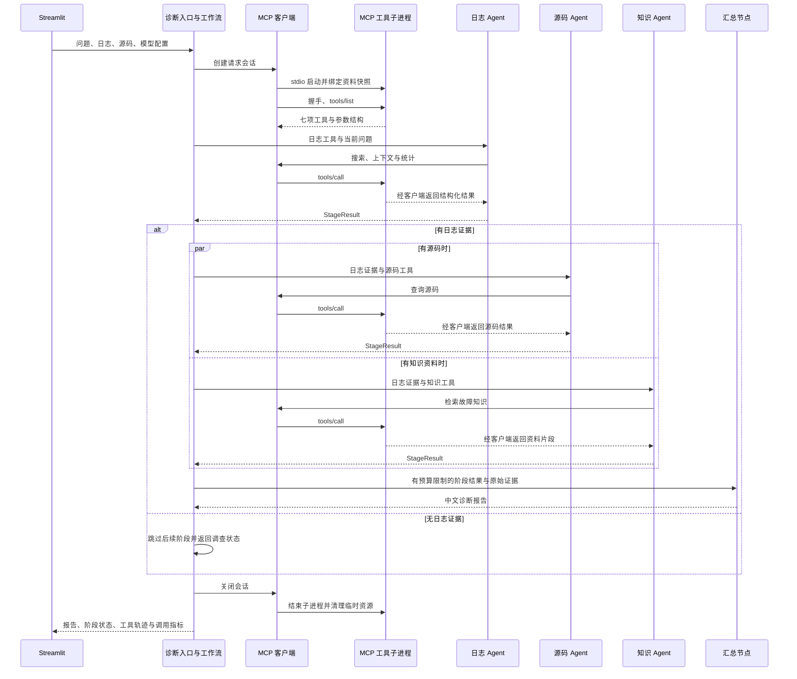

# LogPilot 多 Agent 与 MCP 架构说明

在“智能诊断”的“诊断模式”中选择多 Agent 协同诊断（默认）或单 Agent 诊断（对照）。上传与导航保持原样。

## 执行流程

1. 日志分析 Agent 使用搜索、上下文、统计三个工具调查日志。
2. 有日志证据后，源码定位 Agent 和故障知识 Agent 在两个工作线程中并行执行。
3. 源码角色只有源码工具；知识角色只有知识库检索工具。无源码或无知识库时跳过对应分支。
4. 汇总节点只调用一次模型，结合各阶段状态和工具证据生成报告，不再调用工具。

这是基于 LangChain 专业 Agent 和 Python ThreadPoolExecutor 的显式工作流，未引入 LangGraph。模型实例、回调和调查结果按请求隔离；工作线程不操作 Streamlit 会话。

### 请求时序



该图展示多 Agent 主路径。可选阶段是否运行由资料可用性决定，失败阶段由状态对象记录；汇总模型本身没有工具，不能发起新的调查。

### 为什么这样分工

| 设计 | 对应问题 | 取舍 |
| --- | --- | --- |
| 先查日志 | 源码与知识调查需要共同的故障线索 | 日志阶段是前置依赖 |
| 两个可选分支并行 | 源码定位与历史经验查询可独立开展 | 增加模型调用量，需要分别管理状态 |
| 每个角色独立模型与回调 | 避免并行调查混用调用记录 | 汇总时需要显式合并指标 |
| 只交接有预算的工具证据 | 限制上下文规模，保留结论的核查依据 | 省略信息必须标记，完整轨迹保留在页面 |
| MCP 服务复用仓储层 | 协议适配与业务检索分开演进 | 每次诊断多一次进程启动和协议通信 |

## 阶段状态与证据契约

`StageResult` 保存 `name`、`status`、`findings`、`reason`、`evidence`、`steps`、`events`、`elapsed`、`model_calls` 和 `total_tokens`。工作流使用状态决定是否继续，界面使用指标与轨迹展示调查过程。

| 状态 | 含义 | 后续处理 |
| --- | --- | --- |
| `completed` | 阶段正常完成并满足该阶段要求 | 交接结果 |
| `partial` | 已有证据但调查未完整完成 | 保留证据，报告说明限制 |
| `failed` | 阶段执行失败 | 保存原因；可选分支失败时仍尝试汇总 |
| `skipped` | 无相应资料或前置条件未满足 | 不声称完成过调查 |
| `no_evidence` | 未取得有效诊断证据 | 日志阶段出现此状态时停止后续推断 |

交接摘要最多保留 8,000 个字符，单阶段证据组共享 30,000 字符预算；列表型结果在每组约 12,000 字符范围内优先保留完整条目，省略时设置标记。这些是字符预算，不是 Token 精确预算。原始工具响应仍在调用轨迹中供核查。

源码文件列表、分组计数和工具错误本身不证明某个根因。有效证据需包含实际日志记录、源码内容或检索片段；汇总提示词要求依据这些原始内容检查各角色摘要。

## MCP 工具接入

- `run_diagnosis` 默认通过 MCP 调用全部七项诊断工具，单 Agent 与多 Agent 均已接入。
- 每次诊断启动一个 stdio 子进程，客户端完成握手和工具发现后，将工具按日志、源码、知识三组适配给专业 Agent。
- 日志与源码以请求 ID 绑定至当前进程，工具参数不允许切换资料目录；源码查询只访问已上传文件，不读取任意磁盘路径。
- 资料快照存放于系统临时目录，服务读入后立即删除，退出时清理目录；API Key 通过显式子进程环境传递，不写入快照的配置字段。
- 知识检索复用当前本地 Chroma 知识库，仍需可用的 Embedding 配置；知识文档写入和独立知识问答保留原路径。
- 角色工具分组是 Agent 端的能力限制，不是面向不可信客户端的服务端鉴权。当前不提供远程服务或多租户知识库隔离。
- MCP 失败不会自动回退。显式设置 `LOGPILOT_TOOL_TRANSPORT=local` 或传入 `tool_transport="local"` 可使用原工具路径进行对照。
- `run_multi_diagnosis`、`run_single_diagnosis` 是内部执行器，不传 `tool_provider` 时使用直接工具，便于离线单元测试；应用和 CLI 统一从 `run_diagnosis` 进入。

## 证据与失败处理

- StageResult 是结构化交接对象，包含角色、状态、摘要、工具证据、原因、耗时和调用量。
- 证据由代码从工具响应提取，不从模型文字推断。错误响应、空检索和仅有文件列表不能作为诊断证据。
- 交接保留完整记录并控制字符预算，省略时标记截断；完整工具响应仍可在调查过程中查看。
- 历史问答仅帮助理解追问；每次运行重新调查当前资料。
- 日志无证据时停止后续推断。源码/知识分支失败时，仍尝试汇总日志证据，报告标记为未完整完成。
- 汇总失败时返回阶段状态，保留调查过程；失败轮不加入前端追问历史。
- 工具返回错误时，即使已有部分证据也不会标记该阶段完全成功；已有证据仍可用于降级汇总。
- MCP 握手预算 30 秒、单次工具调用预算 150 秒；超时或断连返回安全错误，底层异常原文不传入模型。进程释放另有少量清理时间。
- 每个专业 Agent 最多 5 次执行迭代，执行器时间预算 120 秒；每次模型请求超时 60 秒、最多一次重试。执行器只在迭代间检查预算，因此这些不是整个请求的硬超时。
- 模型总 Token 来自接口返回，不含 Embedding，缺失用量时显示 0。耗时包含本地处理与 API 等待。
- 引用正确性和修复建议仍需要人工核对。工具证据交接与提示词约束不等于自动证明模型结论正确。

## 文件职责

- logpilot/agents/diagnosis_agent.py：模式分发和原有单 Agent 基线。
- logpilot/agents/workflow.py：日志优先、并行分支、汇总及失败降级。
- logpilot/agents/specialists.py：专业 Agent 执行器和真实工具证据提取。
- logpilot/agents/state.py：阶段结果结构。
- logpilot/prompts/specialist_rules.txt：共享约束。
- logpilot/prompts/log_specialist.txt、source_specialist.txt、knowledge_specialist.txt：角色职责。
- logpilot/prompts/synthesis_prompt.txt：汇总核对规则。
- scripts/compare_agents.py：真实接口对照运行。
- logpilot/integrations/mcp/server.py：MCP 工具服务，复用仓储与知识库查询逻辑。
- logpilot/integrations/mcp/client.py：同步 Agent 到异步 MCP 的适配、工具发现及生命周期管理。
- logpilot/integrations/mcp/context.py：请求资料快照与工具分组。
- scripts/check_mcp.py：独立客户端调用演示。

## 检查

以下命令均在包含 `app.py` 的项目根目录执行，不在 `docs` 目录执行。

不调用模型的测试：

```powershell
.\.venv\Scripts\python.exe -B -m unittest discover -s tests -v
.\.venv\Scripts\python.exe -B -m scripts.check_mcp
```

实际对照（会调用模型并消耗额度；需配置 .env）：

```powershell
.\.venv\Scripts\python.exe -m scripts.compare_agents --mode both --transport mcp
```

可加 `--knowledge` 使用已有知识库，也可用 `--log`、`--sources` 和 `--question` 指定相同输入。两种模式均从空历史开始，报告和耗时/调用量记录保存至 data/evaluation_results/，不会纳入 Git。

对每份报告人工检查：根因是否正确；日志 ID/行号是否真实；源码定位是否匹配；无依据时是否说明限制；修复建议是否可执行。多 Agent 更复杂也可能更慢、更贵，不预设它一定优于单 Agent。原“项目评估”仍只验证本地解析与检索，不代表多 Agent 准确率。
